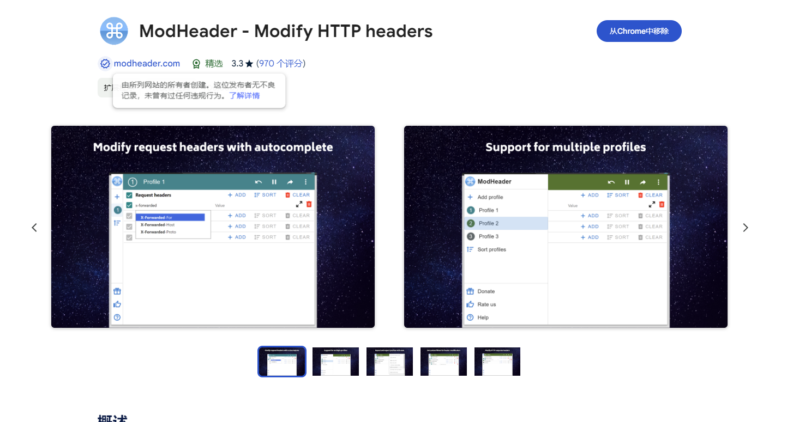
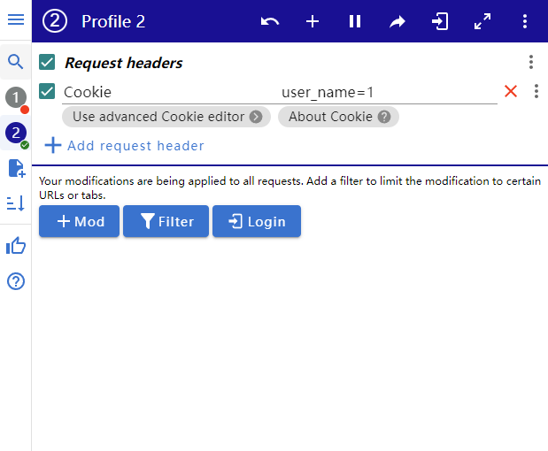
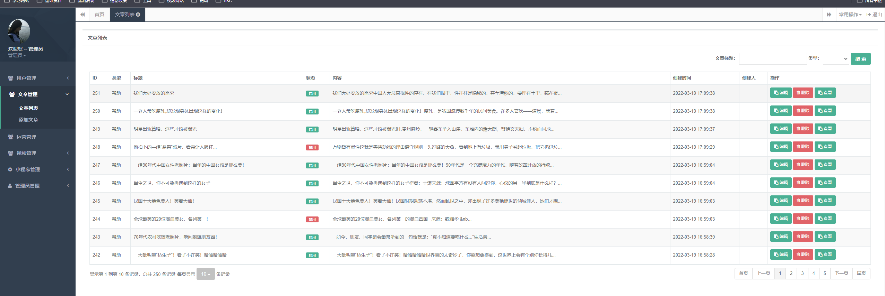

## introduce

Official website address: https://github.com/shmilylbelva/laykefu

Fofa语句：icon_hash="-334624619"

Hunter：web.icon="5d9a19354d0fa3945fea8a1d73be8ac1"

## Vulnerability details

When the "user" in the cookie_ When the name is not empty, login can be bypassed. To verify the vulnerability, we use the browser plugin "ModHeader - Modify HTTP headers", set the value of the cookie to "username=1", and access the backend address can directly enter the backend.

Simply use ModHeader - Modify HTTP headers to add a cookie once, and each time you access other systems, simply modify the URL path to/admin to log in

https://chromewebstore.google.com/detail/modheader-modify-http-hea/idgpnmonknjnojddfkpgkljpfnnfcklj?hl=zh-CN&utm_source=ext_sidebar

Modify the access path to background login path/admin to log in to the system

Cookie user_name=1

